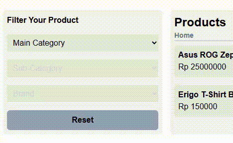
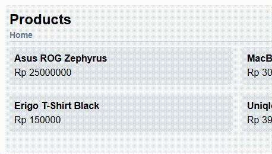
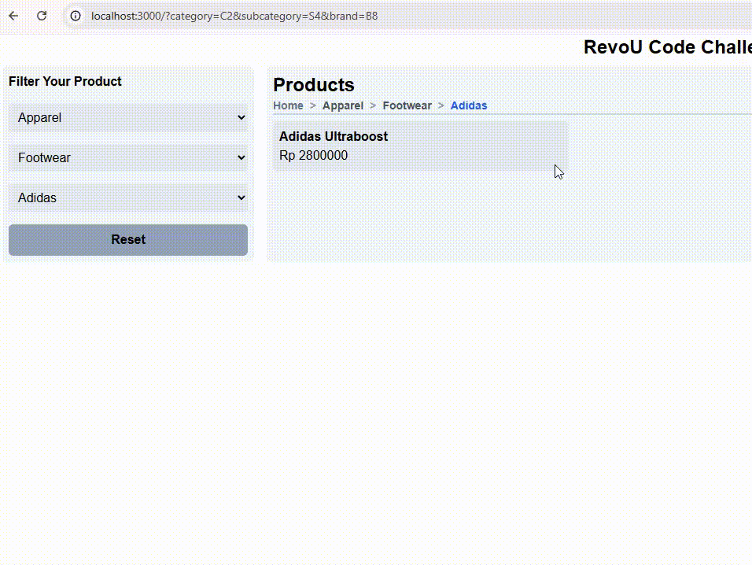
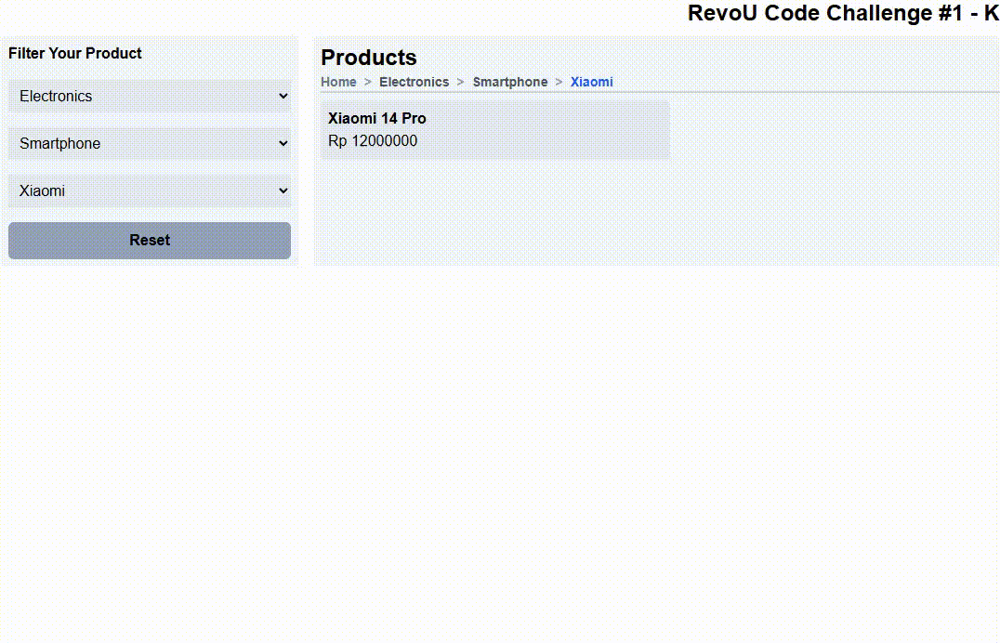

# 🚀 Dynamic Product Catalog Challenge

Hey There! Welcome to my take on the Product Catalog Challenge. While the brief mentioned React Router, I decided to level up and build this using Next.js 15 (App Router) to demonstrate modern Server-Side Rendering (SSR) and seamless URL state management. 🚀✨

## 🌟 Key Features

1. 🛡️ Smart Initial State (brief:1)

   first load, I kept it clean. Only the Main Category is active. To follow the rules of the "Cascading" hierarchy, the Sub-Category and Brand dropdowns are locked (disabled)
   

2. 🌊 Cascading Behavior (brief:2)

   Selecting a category triggers a reactive chain. This chain always filled in with relevant data. So there won't be a Uniqlo Laptop
   

3. 🍞 Dynamic Breadcrumbs (brief:5)

   Navigation that actually knows where you are
   

4. 💾 State Persistence (Refresh-Proof) (breif:6)

   Go ahead—refresh the page, copy the link, or go back/forward in your browser. The filters stay exactly where you left them
   

5. 🧹 One-Click Reset (brief:7)

   Got lost in the filters? Hit the Reset Filter button. It clears the URL back to the base path, instantly returning the UI to the initial "everything shown" state
   

## 📸 Screenshots

.png>)
.png>)
.png>)
.png>)
.png>)

### 🔥 Other Features

Basically all following the challenge brief

### 🛠️ Note

- The style color have not been themed correctly. Best to view when browser is in light mode
- If I have not modified it, data is coming from a const object (not fetching from local .json)

#### No deployment for this time, but you can always try on your machine

#### See ya!
